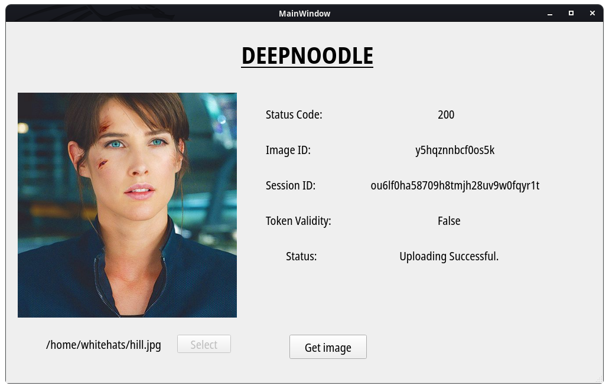

# DeepNoodle GUI - Deepfakes

## Description
DeepNoodle is client version of (deepnudes.to) using [Deepnoodle API](https://github.com/0x0is1/DeepNoodle-API) developed by [0x0is1](https://github.com/0x0is1) to provide service within a gui without any daily limit. A [CLI version](https://github.com/0x0is1/deepnoodle-CLI) available of it using python3.

## Compile
You can compile it by your own using source code provided.

## Requirements
* G++
* Qmake
* Qt C++

## Compatibilty 

All debian distros and windows 10. To be tested on other devices.

* Preview 
 </img>

### **Support authors**:

